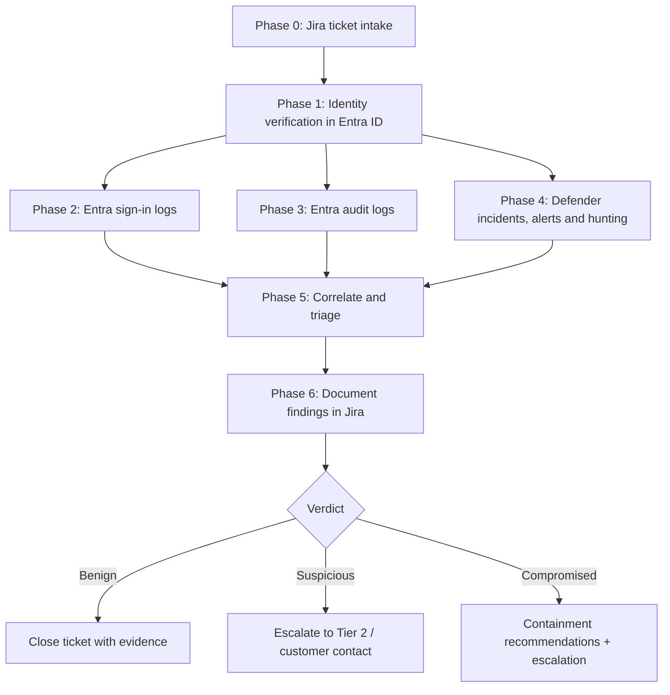

# SOC Workflow: IAM Ticket Investigation

**Scope:** End-to-end workflow for investigating an IAM (Identity and Access Management) ticket as a SOC analyst, driven by an AI agent (Claude) with MCP server integrations.

**Integrations used:**

| System | MCP server | Purpose |
|---|---|---|
| Jira | Atlassian MCP server | Ticket intake, status transitions, evidence documentation, worklogs |
| Microsoft Entra ID | Microsoft MCP server (Graph) | Audit logs, sign-in logs, user/identity lookup |
| Microsoft Defender XDR | Microsoft MCP server (Graph Security) | Incidents, alerts, advanced hunting |

> **Prerequisite note:** The Jira side is fully covered by the Atlassian MCP server today (`getJiraIssue`, `searchJiraIssuesUsingJql`, `addCommentToJiraIssue`, `transitionJiraIssue`, `addWorklogToJiraIssue`, `createIssueLink`). The Microsoft MCP server must expose the Entra/Defender surface listed in [Appendix A](#appendix-a-required-microsoft-graph-endpoints--permissions); a Microsoft 365 connector limited to mail/calendar/Teams/SharePoint is **not** sufficient for this workflow.

---

## Workflow overview



---

## Phase 0 — Ticket intake (Jira via Atlassian MCP server)

**Goal:** Extract everything needed to scope the investigation before touching any security tooling.

1. **Fetch the ticket:** `getJiraIssue` with the issue key (or `searchJiraIssuesUsingJql` for queue sweeps, e.g. `project = SOC AND labels = iam AND status = "Open" ORDER BY priority DESC`).
2. **Extract the investigation parameters:**
   - **Subject identity:** UPN / email of the user in question. If only a display name is given, resolve it in Phase 1 and record the ambiguity.
   - **Time window:** alert timestamp or reported time of the event. Default investigation window if unspecified: **±7 days around the event, 30-day lookback for baselining**.
   - **Trigger type:** what raised the ticket (e.g. suspicious sign-in alert, access request review, offboarding check, privilege change, user-reported phishing, risky-user detection).
   - **Related artifacts:** IPs, device names, app names, alert IDs, incident links already attached to the ticket.
3. **Check for related history:** JQL search for prior tickets on the same identity (`text ~ "<UPN>" AND created >= -90d`). Link relevant priors with `createIssueLink` (type: *Relates*).
4. **Take ownership:** transition the ticket to *In Progress* (`getTransitionsForJiraIssue` → `transitionJiraIssue`) so the queue reflects live state.

**Exit criteria:** Identity, time window, and trigger type are recorded. If the identity cannot be determined from the ticket, comment on the ticket asking the reporter for it and stop — do not guess.

---

## Phase 1 — Identity verification (Entra ID)

**Goal:** Confirm the identity exists, is unambiguous, and understand its blast radius.

Pull via the Microsoft MCP server (Graph `/users`, `/users/{id}/memberOf`, `/identityProtection`):

1. **User object:** object ID, UPN, account enabled/disabled, created date, on-prem synced or cloud-only, employee type (member vs guest).
2. **Privilege check:** directory role assignments and PIM-eligible roles. Any privileged role (Global Admin, Privileged Role Admin, Exchange Admin, etc.) **raises ticket priority one level** — note it immediately in Jira.
3. **Group memberships:** especially groups granting Conditional Access exclusions, app access, or role-assignable groups.
4. **Registered devices and MFA methods:** authentication methods on file (Authenticator, FIDO2, phone, temporary access pass) and when they were registered.
5. **Risk state:** Entra ID Protection `riskyUsers` entry — current risk level, risk state (atRisk / confirmedCompromised / dismissed), and risk detections.

**Exit criteria:** One unambiguous user object identified; privilege level and current risk state recorded in the working notes.

---

## Phase 2 — Sign-in logs (Entra ID)

**Goal:** Establish where, when, how, and from what the identity authenticated.

Source: Graph `auditLogs/signIns` (interactive) and, where available, non-interactive / service-principal sign-in logs. Pull the full investigation window plus the 30-day baseline.

**Collect for each relevant sign-in:** timestamp, app, IP, ASN, geolocation, device (ID, OS, browser, compliance/join state), client app (modern auth vs legacy protocols), Conditional Access result, MFA detail, sign-in risk level, and correlation ID.

**Analyst checklist — flag any of the following:**

- [ ] **Geographic anomalies:** sign-ins from countries the user has no baseline history in; impossible-travel pairs (two sign-ins whose distance/time is infeasible).
- [ ] **Infrastructure anomalies:** anonymizer/VPN/Tor exit nodes, hosting-provider ASNs (residential users signing in from datacenter IPs), previously unseen ASNs.
- [ ] **Protocol anomalies:** legacy authentication (IMAP/POP/SMTP AUTH, older Office clients) — these bypass MFA.
- [ ] **Failure patterns:** bursts of failures followed by a success (password spray / brute force succeeding); failures across many accounts from the same IP.
- [ ] **MFA anomalies:** MFA denials followed by an approval (MFA-fatigue pattern); sign-ins that skipped MFA due to CA exclusions or token replay.
- [ ] **Conditional Access:** any `notApplied` or failure/override on policies that should have applied.
- [ ] **Unfamiliar devices:** unmanaged/non-compliant devices appearing for the first time inside the window.
- [ ] **Risk-flagged events:** any sign-in with risk level low/medium/high and the associated detection type.

**Output:** A short timeline of notable sign-ins (timestamp UTC, IP, geo, app, device, MFA result, risk) — this goes verbatim into the Jira evidence comment.

---

## Phase 3 — Audit logs (Entra ID)

**Goal:** Find what changed *about* or *by* this identity — persistence and privilege-escalation actions live here.

Source: Graph `auditLogs/directoryAudits`, filtered where the user is **initiator or target**, over the investigation window.

**Analyst checklist — high-signal events:**

- [ ] **Credential changes:** password reset/change (self-service or admin), especially shortly after a suspicious sign-in.
- [ ] **MFA method changes:** new authenticator/phone/FIDO2 registered, methods deleted, temporary access pass created. *New MFA method registered from a suspicious session is a classic persistence move.*
- [ ] **Role/privilege changes:** role assignments, PIM activations, addition to role-assignable or admin groups.
- [ ] **Application consent:** OAuth consent grants by the user (illicit consent grant attack), new app registrations or credentials added to apps the user owns.
- [ ] **Device events:** new device registrations/joins tied to the account.
- [ ] **Account lifecycle:** account re-enabled, UPN changed, license changes out of pattern.
- [ ] **Delegation:** mailbox delegation or permissions granted (correlate with Exchange audit if available via Defender hunting, Phase 4).

**Output:** Chronological list of audit events with initiator, target, and result — merged into the master timeline.

---

## Phase 4 — Security events (Microsoft Defender XDR)

**Goal:** Surface detections and raw telemetry the identity is involved in across endpoints, email, identity, and cloud apps.

Sources via the Microsoft MCP server: Graph Security `security/incidents`, `security/alerts_v2`, and `security/runHuntingQuery` (advanced hunting, KQL).

1. **Incidents & alerts:** query `alerts_v2` filtered on the user (UPN/account SID) over the window; retrieve parent incidents, their severity, status, determination, and all correlated entities (devices, IPs, mailboxes, files).
2. **Advanced hunting (KQL) — standard pack for an IAM ticket:**

   ```kql
   // Identity logons across Defender for Identity / endpoints
   IdentityLogonEvents
   | where Timestamp > ago(30d) and AccountUpn =~ "<UPN>"
   | summarize count() by LogonType, DeviceName, Protocol, bin(Timestamp, 1d)
   ```

   ```kql
   // Cloud sign-in telemetry with ISP/risk enrichment
   AADSignInEventsBeta
   | where Timestamp > ago(30d) and AccountUpn =~ "<UPN>"
   | project Timestamp, Application, IPAddress, Country, ISP, DeviceName, RiskLevelDuringSignIn, ErrorCode
   ```

   ```kql
   // Inbox-rule persistence (BEC staple)
   CloudAppEvents
   | where Timestamp > ago(30d) and AccountObjectId == "<objectId>"
   | where ActionType in ("New-InboxRule", "Set-InboxRule", "UpdateInboxRules")
   ```

   ```kql
   // Email received/sent around the event (phishing correlation)
   EmailEvents
   | where Timestamp between (datetime(<start>) .. datetime(<end>))
   | where RecipientEmailAddress =~ "<UPN>" or SenderMailFromAddress =~ "<UPN>"
   ```

3. **Endpoint pivot:** if a device surfaced in Phases 2–4, pull its recent alerts and logon history (`DeviceLogonEvents`) to check whether the device itself is compromised.
4. **Defender for Identity:** review the user's identity page signals — lateral movement paths, unusual protocol use (NTLM/Kerberos anomalies) for hybrid identities.

**Output:** List of incidents/alerts (ID, title, severity, status, determination) plus any hunting hits — merged into the master timeline.

---

## Phase 5 — Correlate & triage

**Goal:** One timeline, one verdict.

1. **Build the master timeline:** merge Phases 2–4 into a single UTC-ordered timeline.
2. **Test the compromise hypothesis:** the strongest signal is *sequence*, e.g. `risky sign-in → password change → new MFA method → OAuth consent → inbox rule`. Isolated anomalies with baseline support (e.g. user on vacation explaining new geo) weaken it.
3. **Assign a verdict:**

| Verdict | Criteria (indicative) | Action |
|---|---|---|
| **Benign / expected** | Anomalies explained by baseline or change records; no Defender detections; no persistence indicators | Document and close |
| **Suspicious** | Unexplained anomalies but no confirmed malicious action; single-source signal only | Escalate to Tier 2; contact user/customer for verification; keep ticket open |
| **Compromised** | Multi-source correlation, confirmed malicious sign-in, persistence actions, or Defender determination of true positive | Immediate escalation + containment recommendations |

4. **Containment recommendations for a Compromised verdict** (recommend in the ticket; execute only per the engagement's authorization model):
   - Revoke all refresh/session tokens; require re-authentication.
   - Reset password; mark user compromised in Entra ID Protection.
   - Remove attacker-added MFA methods, OAuth grants, inbox rules, and device registrations found in Phase 3/4.
   - Isolate implicated endpoints via Defender.
   - Review activity of any accounts the identity could pivot to (shared mailboxes, owned service principals).

---

## Phase 6 — Documentation & closure (Jira)

**Goal:** The ticket is the record. Everything the verdict rests on must be in it.

1. **Evidence comment** (`addCommentToJiraIssue`) using the template below.
2. **Log time** (`addWorklogToJiraIssue`) against the investigation.
3. **Link artifacts:** related prior tickets, and remote links to Defender incidents (`createIssueLink` / remote issue links).
4. **Transition** the ticket per verdict: *Done/Closed* (benign), *Escalated* (suspicious/compromised) — enumerate valid transitions first with `getTransitionsForJiraIssue`.

### Evidence comment template

```
## IAM Investigation Summary — <UPN>
**Verdict:** Benign | Suspicious | Compromised
**Window investigated:** <start UTC> – <end UTC> (baseline: 30d)

### Identity profile (Phase 1)
- Object ID / UPN / enabled state / privileged roles / risk state

### Sign-in findings (Phase 2)
- <timeline rows: timestamp | IP | geo/ASN | app | device | MFA | CA result | risk>

### Audit log findings (Phase 3)
- <chronological directory changes: initiator | activity | target | result>

### Defender findings (Phase 4)
- Incidents/alerts: <ID | title | severity | determination>
- Hunting hits: <query | summary of results>

### Assessment (Phase 5)
- <narrative: why this verdict>

### Actions taken / recommended
- <containment or closure rationale>
```

---

## Operating rules

- **Read-only by default.** Investigation phases only read logs. Any containment action requires the authorization defined by the engagement (MSP/SOC RACI) and is otherwise a *recommendation* in the ticket.
- **Never guess an identity.** Ambiguous identity → ask the reporter via ticket comment and pause.
- **UTC everywhere.** All timestamps in evidence are UTC to keep the timeline mergeable.
- **Privilege escalates priority.** Privileged accounts (admin roles, PIM-eligible) bump ticket priority and shorten SLA.
- **Everything in the ticket.** No finding exists unless it is documented in Jira; raw exports referenced by ID, not pasted secrets/PII beyond what triage requires.

---

## Appendix A — Required Microsoft Graph endpoints / permissions

The Microsoft MCP server must expose (at minimum, read-only):

| Capability | Graph endpoint | Permission (application, least-priv) |
|---|---|---|
| User lookup | `/users`, `/users/{id}/memberOf` | `User.Read.All`, `GroupMember.Read.All` |
| Directory roles / PIM | `/roleManagement/directory` | `RoleManagement.Read.Directory` |
| Sign-in logs | `/auditLogs/signIns` | `AuditLog.Read.All` |
| Directory audit logs | `/auditLogs/directoryAudits` | `AuditLog.Read.All` |
| Identity Protection | `/identityProtection/riskyUsers`, `/riskDetections` | `IdentityRiskyUser.Read.All`, `IdentityRiskEvent.Read.All` |
| Auth methods | `/users/{id}/authentication/methods` | `UserAuthenticationMethod.Read.All` |
| Defender incidents/alerts | `/security/incidents`, `/security/alerts_v2` | `SecurityIncident.Read.All`, `SecurityAlert.Read.All` |
| Advanced hunting | `/security/runHuntingQuery` | `ThreatHunting.Read.All` |

> **Current state:** the Microsoft 365 MCP server configured today exposes mail/calendar/Teams/SharePoint search only. The security surface above must be added (e.g. a Graph Security–capable MCP server or Sentinel MCP integration) before Phases 1–4 can be executed by the agent; until then those phases are performed manually in the Entra and Defender portals following this document.
